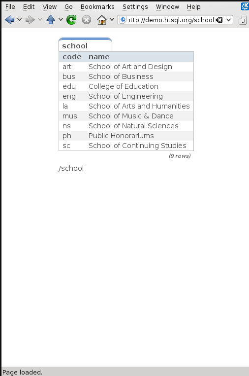

HTSQL -- A Query Language for Accidental Programmers
====================================================

HTSQL is a high-level navigational query language for relational
databases.  It is written by Kirill Simonov and Clark Evans
in the Python language.  HTSQL works with SQLite, PostgreSQL, 
MySQL, Oracle, and Microsoft SQL Server.

:Presenter: Clark C. Evans, Prometheus Research, LLC
:Date: March 24th, 2011
:Location: PgEast US 2011, New York, NY

HTSQL Query Preview
-------------------

For a university database, the following HTSQL request 
returns returns schools, and for each school the number 
of corresponding programs and departments (link_)::

  /school{name, count(program), count(department)}

.. _link:
    http://demo.htsql.org
    /school{name,count(program),count(department)}

The un-optimized SQL equivalent is::

  SELECT sch.name,
     (SELECT COUNT(1) FROM program
       WHERE school = sch.code),
     (SELECT COUNT(1) FROM department
       WHERE school = sch.code)
     FROM school AS sch
   ORDER BY sch.code ASC

HTSQL Query Preview (cont'd)
----------------------------

``/school{name, count(program), count(department)}`` 
optimally translates into::

   SELECT school.name, 
          coalesce(correlated_department.count,0), 
          coalesce(correlated_program.count,0),
   FROM school as school
   LEFT OUTER JOIN (
      SELECT school, COUNT(1) as count 
      FROM department GROUP BY school
   ) AS correlated_department 
   ON (correlated_department.school = school.code)
   LEFT OUTER JOIN (
      SELECT school, COUNT(1) as count 
      FROM program GROUP BY school
   ) AS correlated_program 
   ON (correlated_program.school = school.code)
   ORDER BY school.code ASC

Use as a Web Service
--------------------

* public service for public data
* use querytimeout for PostgreSQL
* ssl + auth for private data

Use via ``.htsql`` Gateway
--------------------------

* web-developers edit ``.htsql`` file
* untrusted users use parameterized queries
* uses ``$var`` for variable substitution

This permits standard HTML forms::

  <form action="/canned.htsql">
    Enter an parameter value:
    <input type="text" name="arg" />
  </form>

Direct use in Python
--------------------

HTSQL can be used either as a WSGI component,
or directly as a data query tool within Python.

::
    >>> from htsql import HTSQL
    >>> from htsql.request import produce
    >>> htsql = HTSQL('pgsql:htsql_regress')
    >>> with htsql:
    ...     for row in produce('/school'):
    ...         print row
    ...

HTRAF Dashboarding
------------------

.. image:: img/htraf_screenshot.png
   :align: left

* HTRAF toolkit (JQuery MIT)
* Automatically manages dependencies 
* Uses HTSQL for data source
* via ``data-xxx`` attributes
* and ``$variable`` substitution

HTRAF Dashboard Source
----------------------

::

 <body>
 <h3>Select a School</h3>
 <select id="school" 
   data-htsql="/school{code, name}?exists(department)">
 </select>
 <h3>Departments</h3>
 
Filter by name: <input id="dept_name"/>

 <table id="department"
   data-htsql="/department{code, name, school.name}
               ?school=$school&name~$dept_name"></table>
 
The number of courses in this department: 
   <strong data-htsql="/department{count(course)}
                       ?code=$department"></strong>
 

 <h3>Courses</h3>
 <table id="course" 
   data-htsql="/course?department=$department"></table>
 </body>

Evolution of HTSQL
------------------

* In 2004, HTSQL started as an XPath-like tool 
  so we could use XSLT on top of PostgreSQL.

* By 2006, data analysts were routinely bypassing 
  our app's user interface, using HTSQL to 
  directly access their data.

* By 2008, we had refactored HTSQL several times,
  with feature and usability feedback from our
  user base... data analysts.

* In 2010, we started a rewrite of HTSQL "2.0" in
  order to fix defects and add features that we 
  couldn't in the 1.0 code base.
  
* Now, in 2011, we're 2/3 done with migrating 1.0
  features and will likely finish by 2012.

What is HTSQL?
--------------

HTSQL is...

.. image:: img/what_is_it.png
   :align: right

* a web access gateway for relational databases
* a sophisticated navigational query language
* a multi-target optimizing query compiler
* a social data-set sharing & refinement tool

HTSQL processor takes a URL, translates it into 
SQL, executes the query against the relational
backend, and returns the formatted result.

Relational Database Web Service
-------------------------------

HTSQL wraps your database with a comprehensive, 
documented web service API.

* HTSQL URLs are translated into SQL
* has JSON, HTML + pluggable formats
* web service does auth & encryption
* access restricted to exposed tables
* 95%+ of query needs are expressable
* 5% of remaining needs exposed as VIEWs

Navigational Query Language
---------------------------

HTSQL is a new kind of query language; although
implemented as SQL -- it isn't relational

* uses ``navigation`` metaphor 
* design center is set-oriented retrieval
* complex aggregates, linking, and projections
* macros used to factor common sub-expressions
* row definition separate from field selection
* multi-segment queries for hierarchical output
* language design field-tested for 5 years

Multi-Targeting Optimizing Compiler
-----------------------------------

HTSQL is a full-blown compiler targeting SQL 
variants from various DBMS implementations.

* SQLite, PostgreSQL, MySQL, MSSQL, Oracle
* unified semantics across DBMS vendors
* works with existing relational schemas
* optimizer tries to find optimal SQL form
* easy to add new functions and data types
* detailed contextual error reporting 
* robust regression test suite

Social Data Set Sharing (1/2)
-----------------------------

.. image:: img/triangle.png
   :width: 65%
   :align: right

* data analyst vs programmer
* different reference documents
* different language used
* confusion on data meaning

Social Data Set Sharing (2/2)
-----------------------------

.. image:: img/sharing.jpg
   :width: 65%
   :align: right

* shared language among team members
* queries are emailed & tweaked
* test cases include live queries
* queries are concrete evidence

HTSQL in 10 Minutes
-------------------

Let's assume we have a data model, with schools, 
departments, programs and courses.  Here it is::

      +-------------+       +--------+     
 /---m| DEPARTMENT  |>-----o| SCHOOL |m----\   
 |.   +-------------+  .    +--------+    .|   
 | .                  .                  . |
 |   department   department    a school   |
 |   offers       may be part   has one or |
 |   courses      of school     programs   |
 |                                         |
 |    +-------------+       +---------+    |
 \---<| COURSE      |       | PROGRAM |>---/
      +-------------+       +---------+

#1 - Selecting Data
-------------------

* curly brackets are selectors
* postfix operators are sorting (+/-)

An example (E1_)::

    /course{department+, no, credits-, title}

.. _E1: 
    http://demo.htsql.org
    /course{department+,no,credits-,title}

#2 - Linking Data
-----------------

* we use period to signify a link, or join 
* wildcard ``*`` pulls all columns from a table

An example (E2_)::

    /department{school.name, *}

.. _E2: 
    http://demo.htsql.org
    /department{school.name,*}

#3 - Filtering Data
-------------------

* question mark ``?`` indicates filter
* single-quote literal strings

For example (E3_)::

    /course?credits<3&department.school='ns'

.. _E3: 
    http://demo.htsql.org
    /course?credits<3&department.school='ns'

#4 - Aggregating Data
---------------------

* one-to-many links are "plural"
* all plural links require aggregates
* nested aggregates are possible

An example (E4_)::

    /school{code, avg(department.count(course))}

.. _E4: 
    http://demo.htsql.org
    /school{code, avg(department.count(course))}

#5 - Projections
----------------

* projections (``^``) build DISTINCT relations
* implemented in 2.1; documentation needed ;)

An example (E5_)::

    /(program^degree){*,count(^)}

.. _E5: 
    http://demo.htsql.org
    /(program^degree){*,count(^)}

#6 - Pluggable Formatters
-------------------------

* use ``/:format`` to specify formatter
* supports CSV, JSON, TXT, HTML
* XML, YAML and others in later releases

An example (E6_)::

    /school/:txt

.. _E6: 
    http://demo.htsql.org
    /student/:txt

#7 - Table Expressions
----------------------

* use ``limit(#, offset)`` to slice data
* use ``sort()`` to sort a table expression
* other forms of table expressions possible

An example (E7_)::

    /department.sort(school).limit(10,5)

.. _E7: 
    http://demo.htsql.org
    /department.sort(school).limit(10,5)

#8 - Multi-Segments
-------------------

* use slash ``/`` to make hierarchical sets
* perhaps in version 2.2 or 2.3?

An example (E8_)::

    /school{code, /department, /program}

.. _E8: 
    http://demo.htsql.com
    /school/(department;program)

Development Status
------------------

HTSQL is quite usable currently, but it may
have gaps for a given application.  Particular
items we'll be addressing in coming months are:

* a mechanism to override catalog configuration
* a way to add custom commands and formatters
* support for roles and user pass-through
* hierarchical queries & streaming result sets
* more maturity and exciting features!

How do I get it?
----------------

Open Community

* source code is up on bitbucket
* free of charge for PostgreSQL, MySQL, etc.
* no restrictions on commercial applications
* we are at #htsql on irc.freenode.net

Dual-License & Support

* license for use /w commercial database systems
* we sell support packages and consulting

Q&A
---

Please visit our community site, http://htsql.org, our commercial site
http://htsql.com, we are best found at #htsql on freenode.  The source
code is freely available at http://bitbucket.org/prometheus/htsql

Generous support for HTSQL was provided by Prometheus Research, LLC and
The Simons Foundation. This material is also based upon work supported
by the National Science Foundation under Grant #0944460. 

