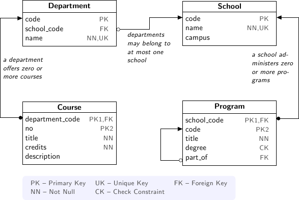
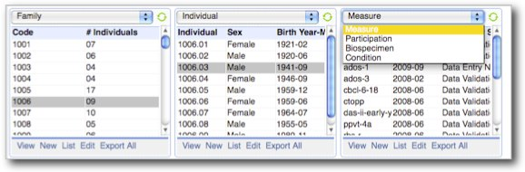

HTSQL : A Conceptual Framework for Link Navigation
==================================================

HTSQL is a high-level navigational query language for relational
databases.  It is written by Kirill Simonov and Clark Evans in the
Python language.  HTSQL works with SQLite, PostgreSQL, MySQL, Oracle,
and Microsoft SQL Server. 

:Presenter: Clark C. Evans, Prometheus Research, LLC
:Date: May 20, 2011
:Location: PgCon 2011, Ottawa, Canada

What is HTSQL?
--------------

.. image:: img/what_is_it.png
   :width: 35%
   :align: right

* a navigational query language
* a web gateway for PostgreSQL
* used by data analysts & researchers
* field tested by users for 6+ years

HTSQL is NoSQL for PostgreSQL ;)

Relational Algebra is a Poor Fit
--------------------------------

.. image:: img/poorfit.jpg
   :width: 45%
   :align: left

* poor choice for elementary operations 
* difficult encoding of business inquiries
* simple cases pay price of extreme flexibility
* easy to write incorrect queries & get wrong results

SQL violates strict relational model to
overcome real limitations in the theory.

What is Navigational Model?
---------------------------

Let's use entity relationships as navigation,
and build query language around this principle.

* recurrent idea from CODASYL, OODBMS, to ORMs
* intuitive mapping from business inquiries
* automate tedious constructs (joins, casts)
* keep collection based processing
* keep predicate logic & aggregations
* keep projections, but as separate operator

Theory follows practice.

Example University Schema
-------------------------

SQL conflates Rows & Columns
----------------------------

  "Please list departments; for each department,
   show the corresponding school's campus." 

::

     SELECT d.code, d.name, s.campus
     FROM ad.department AS d
     LEFT JOIN ad.school AS s
            ON (d.school_code = s.code);

The business inquiry asks for a specific set of rows, and then
correlated columns.  The SQL encoding returns a subset of a cross
product making it difficult to ensure what each row represents. 
The ``FROM`` clause doesn't just pick rows, it also plays and auxiliary
role in choosing columns.

Keep Row Definition Separate
----------------------------

  "Please list departments; for each department,
   the show the corresponding school's campus." 

::

    /department{code, name, school.campus}

The navigational translation separates the row definition from the
column selection.  The linking is implicit, and correct.  The encoded
query can be read aloud as a verbal inquiry.

SQL Conflates Filters & Links
-----------------------------

  "For each department, return the department's
   name and number of courses having more than
   3 credit hours."

::

     SELECT d.name, COUNT(SELECT TRUE FROM ad.course AS c
                          WHERE c.department_code = d.code
                            AND c.credits > 3  )
     FROM ad.department AS d;

For the SQL encoding of this inquiry we use a subquery to avoid row and
column conflation.  However, ``WHERE`` clause in the subquery conflates
logic filter with the glue linking department and course.

SQL Optimization Makes things Worse
------------------------------------

  "For each department, return the department's
   name and number of courses having more than
   3 credit hours."

::

     SELECT d.name, count(c)
     FROM ad.department AS d
     LEFT JOIN ad.course AS c
            ON (c.department_code = d.code
                AND c.credits > 3)
     GROUP BY d.name;

To optimize, the subquery is replaced by a ``GROUP BY`` projection. 
This gives us both row/column and link/filter conflation, obfuscating
the business inquiry.

Navigational Model Doesn't Conflate
-----------------------------------

  "For each department, return the department's
   name and number of courses having more than
   3 credit hours."

::

     /department{name, count(course?credits>3)}

The navigational translation keeps the business logic separate from the
link and the row definition separate from output columns.  The encoded
query corresponds to the original inquiry.

Conflating Projection with Aggregation
--------------------------------------

  "How many departments by campus?"

::

   SELECT s.campus, COUNT(d)
   FROM ad.school AS s 
   LEFT JOIN ad.department AS d
     ON (s.code = d.school_code)
   WHERE s.campus IS NOT NULL
   GROUP by s.campus;

In the schema there isn't a ``campus`` table, you have to take
*distinct* values from the school table.  In this SQL query its not
clear if the ``GROUP BY`` is used only to produce an aggregate, you
have to examine primary key columns to know for sure.

Keep Projection Separate
------------------------

  "How many departments by campus?"

::

   /(school^campus) {campus, count(school.department)}

In a navigational approach, you first construct the projection
explicitly (using ``^`` operator).  Then, you select from it. 
In this way the aggregation is indicated separately as part of the
column selector rather than being confused with the row definition.

For SQL, Modest Complexity is Painful
-------------------------------------

  "For each school with a degree program, return 
   the school's name, and the average number of 
   high-credit (>3) courses its departments have."
  
::

   SELECT s.name, o.avg_over_3 FROM ad.school AS s
   JOIN ad.program AS p ON (p.school_code = s.code)
   LEFT JOIN (
       SELECT d.school_code, AVG(COALESCE(i.over_3,0)) AS avg_over_3
       FROM ad.department d
       LEFT JOIN (
           SELECT c.department_code, COUNT(c) AS over_3
            FROM ad.course AS c WHERE c.credits > 3
            GROUP BY c.department_code
       ) AS i ON (i.department_code = d.code)
       GROUP BY d.school_code
   ) AS o ON (o.school_code = s.code)
   GROUP BY s.name, o.avg_over_3;

Navigation to the Rescue
------------------------

  "For each school with a degree program, return 
   the school's name, and the average number of 
   high-credit (>3) courses its departments have."
  
::

     /(school?exists(program))
       {name, avg(department.count(course?credits>3))} 

Case Study: RexDB Constraint Report
-----------------------------------

* RexDB is data management platform to help medical researchers
  collect, organize, and analyze data sets.
* Core hierarchy is ``family``, ``individual`` and ``measure``
  plus dozens of support tables.
* One critical task is reporting on a subject's  progress
  though phases of a study and data quality.
* We use constraints to check for inconsistencies that may 
  indicate a data quality problem to be investigated.

Case Study: RexDB Constraint Report
-----------------------------------

.. image:: img/rexdb_constraint.jpg
   :width: 35%
   :align: right

* many tabular queries for each report
* entities are rows, checks are columns
* constraints are TRUE/FALSE/NULL (missing data)
* arbitrary subset of entities may be checked
* individual constraints can be very complex

Case Study: RexDB Constraint Report
-----------------------------------

Since rows & columns are clearly isolated, queries can be composed
dynamically.  The general template is::

   /individual{id, check_1, check_2}?filter
   
A specific check a researcher may configure looks like::

   /individual{id, adi_sanity, srs_13_pair}
      ?sex='m'&exists(participation.study='aie')
   :where(srs_13_pair := !exists(srs?q3>24|q1>7),
          adi_sanity := ... )

This returns male *individuals* participating in the ``'aie'`` study,
executing two completely orthogonal checks. 

Towards a Navigational Model
----------------------------

* Relative to any context, there are *singular*  (at most one) and
  *plural* (zero or more) expressions. 
 
* Expressions produce a *flow*, a stream of values -- either of scalar
  type (such as ``integer`` or ``string``) or record type (``school`` or
  ``department``).

* Singular expressions are available for scalar computation or as a
  column selection.

* Plural expressions must be wrapped in an aggregate, such as ``count``,
  ``sum``, or listed as an ``array``.

Navigational Operations
-----------------------

* Scalar Expressions (literals, arithmetic, predicates)
* Navigation (listing a table, linking tables)
* Filtering (sieve, sort, and truncate)
* Selection (choosing & naming attributes)
* Aggregation (convert plural to singular expression)
* Projection (collecting distinct values)
* Decoration (formatting hints)

Scalar Expressions
------------------

Literal Values
  ``/{3.14159, 'Hello World'}``

Algebraic Expressions
  ``/(3+4)*6``

Predicate Expressions
   ``/true()|(false()&true())``

Relative to a table, column attributes are scalar values.

Navigation
----------

Navigation is the primary mechanism for defining what each 
output row means or corresponds to.  Consider the following::

  ``/school.department``

1. ``school`` is a flow (stream) of school records

2. for each school record, ``.department`` produces
   a subflow of associated departments

3. so ``school.department`` is then the merged flow
   with departments by school

4. ``/`` lists items from this merged flow

Filtering
---------

Filtering doesn't change what each row means, but it
does change what rows are produced.

Sieve
  ``/school?campus='north'``

Sort
  ``/school.order(campus)``

Truncate
  ``/school.limit(2)``

Selection
---------

Selection is the mechanism for changing what column attributes are
included in each value of the output.

Output Selection
  ``/school{name, campus}``

Calculated Attributes::
  
    /school.define(num_dept:=count(department))
    {code, num_dept}?num_dept>3

Up-Stream References::

   /define($avg:=avg(course.credits))
   .course?credits>$avg

Aggregation
-----------

Aggregation converts a plural expression into a singular one;
it incorporates sub-flows without changing the row definition.

Counts & Existence
  ``/school{name, count(department)}?exists(program)``

Nested Aggregation::

  /school{name, avg(department.count(course)),
                avg(department.course.credits)}

Nested Lists (this winter?)
  ``/school{name, /department}``

Projection
----------

Projection re-defines the meaning of a flow to include only
distinct values from a particular selection.

Distinct Values
  ``/school^campus``

Complement Space
  ``/(school^campus){campus, count(school)}``

Distinct Selection
  ``/program^{school.campus, degree}``

Advanced Navigation
-------------------

While the basic navigation follows foreign key links, arbitrary links
are permitted.  The ``fork()`` syntax sugar links to the same table.

Linking Operator
  ``/school.({code}->department{school_code})``

Fork Syntax
  ``/course?credits>avg(fork().credits)``

Decoration
----------

Marking parts of the stream with post-processing hints so
that the navigation can be completed with pretty formatting.

Output Labels
  ``/school{name, count(department) :as '# of Dept.'}``

This area of the language needs more definition, but is
needed for declarative inclusion of formatting directives.

HTSQL Implementation
--------------------

.. image:: img/service.png
   :width: 99%
   :align: left

HTSQL Compiler
--------------

Development Status
------------------

HTSQL is quite usable currently, but it may
have gaps for a given application.  Particular
items we'll be addressing in coming months are:

* more documentation!
* a mechanism to override catalog configuration
* a way to add custom commands and formatters
* support for roles and user pass-through
* hierarchical queries & streaming result sets

How do I get it?
----------------

Open Community

* source code is up on bitbucket
* free of charge for PostgreSQL, MySQL, etc.
* no restrictions on commercial applications
* we are at #htsql on irc.freenode.net

Dual-License & Support

* license for use /w commercial database systems
* we sell support packages and consulting

Q&A
---

Please visit our community site, http://htsql.org, our commercial site
http://htsql.com, we are best found at #htsql on freenode.  The source
code is freely available at http://bitbucket.org/prometheus/htsql

Generous support for HTSQL was provided by Prometheus Research, LLC and
The Simons Foundation. This material is also based upon work supported
by the National Science Foundation under Grant #0944460. 

.. include:: <s5defs.txt>
