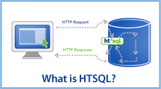

HTSQL -- a Query Language for Accidental Programmers
====================================================

:Presenter: Clark C. Evans, Prometheus Research
:Date: November 3rd, 2010
:Location: PGWest 2010, San Francisco, CA

HTSQL ("Hyper Text Structured Query Language") is a web-based,
high-level query language for relational databases. 

Today's Talk
------------

Part I
~~~~~~
* Why is querying so hard?
* Who am I?  What is HTSQL?
* HTSQL in 10 Minutes
* HTSQL Applications
* Q&A

Part II
~~~~~~~
* Walk-Through
* Final Q&A

Quite simply, I only need ...
-----------------------------

Business user::

  "I *just* need a list of schools and the number 
  of departments and programs for each?"

Developer::

  "Got it! This one is easy -- give me 15 minutes."

Crickets::
  
  *chrip*  *chirp*

it's easy, no?
--------------

A junior SQL developer might produce an *obvious* answer::

   SELECT school.name, 
          count(department),
          count(program) 
   FROM school
   LEFT OUTER JOIN department
   ON (department.school = school.code)
   LEFT OUTER JOIN program 
   ON (program.school = school.code)
   GROUP BY school.name

\... that (luckily) also happens to be
*obviously* ``incorrect``.

Perhaps it's not so trivial?
----------------------------

::

   SELECT school.name, 
          coalesce(correlated_department.count,0), 
          coalesce(correlated_program.count,0),
   FROM school as school
   LEFT OUTER JOIN (
      SELECT school, COUNT(1) as count 
      FROM department GROUP BY school
   ) AS correlated_department 
   ON (correlated_department.school = school.code)
   LEFT OUTER JOIN (
      SELECT school, COUNT(1) as count 
      FROM program GROUP BY school
   ) AS correlated_program 
   ON (correlated_program.school = school.code)

But... it should be easy
------------------------

This business user's request::

  "I *just* need a list of schools and the number 
  of departments and programs for each?"

really *is* trivial.  How about an alternative_ (plot_)::

  /school{name, count(department), count(program)}

This is HTSQL -- a new query language designed from 
the bottom up to be usable by accidental programmers.

.. _alternative:
   http://demo.htsql.org
   /school{name,count(department),count(program)}

.. _plot:
   http://demo.htsql.com
   /school{code,count(department),count(program)}
   /chart(title='%23%20Department%20%26%20Program%20by%20School')

Who am I?
---------

* I'm Clark Evans, principal at Prometheus Research, LLC.
* We serve medical researchers and informatics projects
* Our customers are smart, data-oriented -- not programmers
* Our primary HTSQL users are data analysts
* Kyrylo Simonov is the primary architect of HTSQL

What is HTSQL?
--------------

HTSQL is...

* a sophisticated graph-oriented query language
* a web access gateway for relational databases
* a extendible data processing/presentation framework
* a wicked smart tool for smart data heads
* 90% of expressive power, 10% of the complexity

HTSQL Processing Model
----------------------

.. image:: img/flow.jpeg
   :width: 70%

a bit more technical
--------------------

* on startup, introspects table relationships
* relationships are edges in a graph model
* processor translates graph requests into SQL
* handles complex filters, projections and aggregates
* extensive, pluggable support for post-processing

Why did we make it?
-------------------

.. image:: img/triangle.png
   :width: 70%

We were dealing with users having extremely complex data -- traditional
techniques for communication wasn't going to work.

A Shared Language
------------------

.. image:: img/sharing.jpg
   :width: 70%

Our users, analysts, and developers now use a shared query language,
while it's not a perfect understanding, it is much better.

Evolution of HTSQL
------------------

* started as tool to complement XSLT (2004)
* internal analysts became primary users (2005)
* end users started to use HTSQL directly! (2006)
* complete redesign with lessons learned (2006)
* large deployments, more refinements (2007-2008)
* rewrite for speed, fixing semantic issues (2009)
* porting HTSQL to commercial databases (2010)

Self-Service Reporting
----------------------

* business analysts are 1st line of inquiry
* end-users sometimes tweak queries!
* dashboard developers use HTML/JQuery + HTSQL
* dba's help with data model changes, views
* system developers do custom commands, transforms
* easy to share (just email!) and format data

Developer Productivity
----------------------

* queries are easy to grok, use and modify
* accidental join errors are impossible
* complex (impossible?) queries are feasible
* processing framework is extensible
* smaller inbox due to self-service for analysts 
* expose VIEWs to HTSQL for 5% problems 

HTSQL in 10 Minutes
-------------------

Let's assume we have a data model, with schools, 
departments, programs and courses.  Here it is::

      +-------------+       +--------+     
 /---m| DEPARTMENT  |>-----o| SCHOOL |m----\   
 |.   +-------------+  .    +--------+    .|   
 | .                  .                  . |
 |   department   department    a school   |
 |   offers       may be part   has one or |
 |   courses      of school     programs   |
 |                                         |
 |    +-------------+       +---------+    |
 \---<| COURSE      |       | PROGRAM |>---/
      +-------------+       +---------+

#1 - Selecting Data
-------------------

* curly brackets are selectors
* postfix operators are sorting (+/-)
* use ``as`` to rename columns for presentation

An example (E1_)::

    /course{department as 'Dept Code'+, number as 'No.',
            credits-, title}

.. _E1: 
    http://demo.htsql.org
    /course{department%20as%20'Dept%20Code'+,number%20as%20'No.',
            credits-, title}

#2 - Linking Data
-----------------

* we use period to signify a link, or join 
* multiple levels of linking is possible
* use curly brackets for nested links
* wildcard ``*`` pulls all columns from a table

An example (E2_)::

    /course{department{school.name, name}, * }

.. _E2: 
    http://demo.htsql.org
    /course{department{school.name, name}, *}

#3 - Filtering Data
-------------------

* the question mark ``?`` indicates filter
* single-quote literal strings
* full predicate algebra
* pluggable function support

For example (E3_)::

    /course{department, number, title}?
       credits<3&department.school='ns'

.. _E3: 
    http://demo.htsql.org
    /course{department, number, title}?
       credits<3&department.school='ns'

#4 - Aggregating Data
---------------------

* one-to-many links are "plural"
* all plural links require aggregates
* nested aggregates are possible

An example (E4_)::

    /school{code, avg(department.count(course))}

.. _E4: 
    http://demo.htsql.org
    /school{code, avg(department.count(course))}

#5 - Projections & Segments
---------------------------

* projections (``^``) build new DISTINCT relations
* use ``/`` to merge-sort correlated data sets
* currently 1.0 feature only (3-4 months for 2.0)

An example (E5_)::

    /program{degree^, count()}/student

.. _E5: 
    http://demo.htsql.com
    /program{degree^, count()}
    /student

#6 - Pluggable Formatters
-------------------------

* use ``/:format`` to specify formatter
* supports CSV, JSON, TXT, HTML
* XML, YAML and others (3-4 months for 2.0)

An example (E6_)::

    /school/:txt

.. _E6: 
    http://demo.htsql.org
    /student/:txt

#7 - Table Expressions
----------------------

* use ``limit(#, offset)`` to slice data
* use ``sort()`` to sort a table expression
* other forms of table expressions possible

An example (E7_)::

    /department.sort(school).limit(10,5)

.. _E7: 
    http://demo.htsql.org
    /department.sort(school).limit(10,5)

Canned ``.htsql`` Queries
-------------------------

* web-developers edit ``.htsql`` file
* untrusted users use parameterized queries
* uses ``$var`` for variable substitution

This permits standard HTML forms::

  <form action="/canned.htsql">
    Enter an parameter value:
    <input type="text" name="arg" />
  </form>

JQuery / Data Binding
---------------------

* no server-side programming
* automatic data binding for widgets
* easy dashboard constructions

changes list box makes table auto-update::

  <select id="school" 
     data-source="/school{code, name"} />

  <table id="department"
     data-source="/department?school=$school" />

Why HTSQL 2.0?
--------------

* a full audit of the source and semantics
* our HTSQL 1.0 was not a "community" product
* internal catalog wasn't extensible  
* inability to provide custom types/functions
* function behavior varied across databases
* core query implementation was non-streaming
* program API was 4+ years old and it showed

Temporary 2.0 Limitations
-------------------------

* it is in *beta* and may change
* no custom commands, primitive formatters (yet!)
* no projections or segment queries
* only supports PostgreSQL 
* query results are not streaming
* no way to override catalog configuration

Systematic Considerations
-------------------------

* Currently transitioning from 1.0 to 2.0 (beta)
* URL syntax deviates from HTML FORM expectations
* License is BSD + Non-OSI "No Commercial DB"
* Implementation is in Python using Psycopg2.

How do I get it?
----------------

* free of charge for PostgreSQL, MySQL, etc.
* open source code, open community
* commercial license for Oracle, Microsoft SQL, etc.
* we'd love to hear from you

There are a few syntax changes (mostly with regard
to commands) that we'll be changing in HTSQL 2.0.

Q&A
---

Please visit our community site, http://htsql.org, our commercial site
http://htsql.com, or chat with Clark or Kyrylo here in Ann Arbor.  We
are best found at #htsql on freenode.  We have regular Python releases,
with source code at http://bitbucket.org/prometheus/htsql

Generous support for HTSQL was provided by Prometheus Research, LLC and
The Simons Foundation. This material is also based upon work supported
by the National Science Foundation under Grant #0944460. 

