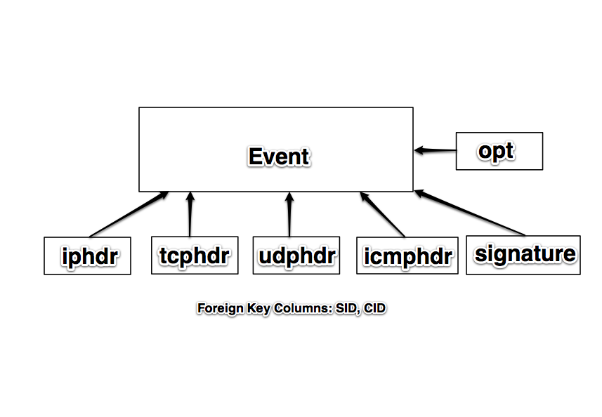
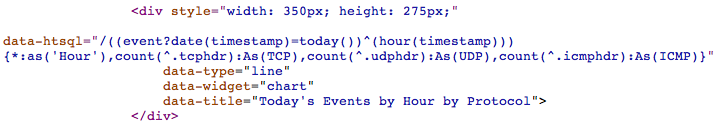

Rapid Report Generation for the System Administrator
====================================================
Using the Snort database as an example, I will show
you how to use HTSQL as a tool to simplify generation
of reports and dashboards.

You can view the demo at http://htsql.org/gallery/snort/index.html

:Presenter: Dan Ferris, Prometheus Research, LLC
:Date: May 13th, 2011
:Location: BSDCan, Ottawa Ontario

Introduction
------------

* Getting data into databases is easy. 
* Getting meaningful data out is hard.
* Reporting infrastructure can get very complex.  My previous employer had 4 full time employees working on a unified reporting system for 2500 network devices.  Every time we introduced a new device or service, reporting was at least 50% of development time.

What's so Special about Snort Anyway
------------------------------------

* Snort is the most popular Open Source IDS.
* In most situations Snort is most useful when logging alerts to a database.
* The Snort database is complicated enough that writing an application is time consuming.
* The HTSQL principles shown will carry over to other apps that report to a database (jrtg, syslog-ng/rsyslog, FreeRadius, or custom applications).

The (Simplified) Snort DB Schema
--------------------------------

What is HTSQL?
--------------

* In its most basic form, HTSQL is a web gateway to a relational database.
* HTSQL is a sophisticated query language.
* In a nutshell, HTSQL takes a specially formatted URL, translates it to SQL statements, and then returns formatted results from the database.

HTSQL Example
-------------
 
* An HTSQL query that returns the source and destination IPs from the last 10 events sorted by source:
    .. image:: img/htsql1.png
       :align: center

HTSQL Example
-------------

``/iphdr{inet(ip_src)-, inet(ip_dst)}.limit(10)``

Translated SQL::

    SELECT ('0.0.0.0'::INET + "iphdr"."ip_src"),
           ('0.0.0.0'::INET + "iphdr"."ip_dst")
    FROM "public"."iphdr" AS "iphdr"
    ORDER BY 1 DESC, "iphdr"."sid" ASC, "iphdr"."cid" ASC
    LIMIT 10

What can HTSQL do for you?
--------------------------

*   HTSQL makes sharing data very easy.  For example,
    a business analyst can email an HTSQL query to a DBA
    to show what data is needed for an application or report.

*   HTSQL queries can be bookmarked, linked on a web page,
    or shared via IM.  Since the query is a URL, you can do
    anything you would normally do with a URL.

*   Less technical users can master the basics of HTSQL in a 
    few hours.  As we say: "Write a user a query and they will
    go away for a day.  Teach them to query and they will go away."

*   Quickly and easily create dashboards and mashups using HTRAF.

*   At Prometheus, HTSQL powers our RexDB application.  RexDB is used by many universities to access/store information about families with Autism.

The Nitty Gritty
----------------

* The most common useage of HTSQL is as a WSGI web service listening to an unprivileged TCP port.  The service will respond to anything that can send an HTTP GET request.

* If you use Python, you can import HTSQL directly into your scripts.

* With Perl, you can use LWP.

* With the shell, you can use curl or wget.

The Nitty Gritty
----------------

Python using HTSQL directly:

::

    from htsql import HTSQL
    from htsql.request import produce
    htsql = HTSQL('pgsql://user:pw@localhost:5432/snort')
    with htsql:
        for row in produce('/signature{sig_name}'):
            print "Signature: " + row[0]

	
The Nitty Gritty
----------------

Bash with curl:

::

    IFS=$'\n'
    HTSQL='http://snort.htsql.org/signature\{sig_name\}/:csv'
    for line in $(curl -s $HTSQL | tr '\r\n' '\n')
    do
        echo "Signature: $line"
    done

The Nitty Gritty
----------------

Perl using LWP:

::

    my $server = 'http://snort.htsql.org';
    my $htsql = '/signature{sig_name}/:csv';
    use LWP::Simple;
    my $results = get $server . $htsql;

    @results = split(/\r\n/, $results);

    foreach $row (@results)
    {
        print "Signature: $row\n";
    }

The Nitty Gritty
----------------

Partial Output:

::

    Signature: PSNG_UDP_PORTSCAN
    Signature: (http_inspect) NON-RFC DEFINED CHAR
    Signature: (http_inspect) U ENCODING
    Signature: (http_inspect) OVERSIZE REQUEST-URI DIRECTORY
    Signature: PSNG_UDP_DISTRIBUTED_PORTSCAN

Insta-Blacklist Example
-----------------------

::

    $server='http://snort.htsql.org';
    $htsql='/distinct(event{inet(iphdr.ip_src)}
    ?signature.sig_priority=1)/:csv';

    use LWP::Simple;

    $result = get $server . $htsql;
    @result = split(/\r\n/, $result);

    shift(@result); #get rid of the column names

    foreach $ip (@result)
    {   
        print "Blocking $ip\n";
        system("ipfw add deny all from $ip to any");
    }

Brief HTSQL tutorial
--------------------

* The easiest HTSQL query is to get the contents of a table:

Display the iphdr table from the snort DB:

``/iphdr``

Brief HTSQL tutorial
--------------------
* It's much better if you can only select certain columns in the table.
  This is done with the squiggly brackets { and }

``/iphdr{ip_src, ip_dst}``

* Note that Snort stores IP addresses as a 32 bit signed interger.  HTSQL
  can convert that to the familiar dotted quad notation with the inet()
  function.

``/iphdr{inet(ip_src), inet(ip_dst)}``

* Data can be sorted by adding a + or - after the column.

``/iphdr{inet(ip_src)-, inet(ip_dst)}``

Brief HTSQL tutorial
--------------------
* HTSQL allows you to filter data.  A filter goes at the end of the {} selector
  and is seperated with the ?

``/iphdr{inet(ip_dst)}?inet(ip_src)='216.243.150.122'``

* Filter operators include, =, >, <, >=, <=, and ~

* Filters can be combined with AND ( & ) and OR ( | )

``/tcphdr{tcp_dport}?tcp_dport='21'|tcp_dport='139'``

* The ! operator is used for logical negation.

``/tcphdr{tcp_dport}?tcp_dport!='21'``

Brief HTSQL tutorial
--------------------
* Databases aren't very useful if you can't join data from different tables
  based on foreign key constraints.  All you have to do is put tablename.column 
  in the {} selector or in your filter.

``/event{signature.sig_name}?cid='1234'``

* Multiple tables can be joined:

``/tcphdr{tcp_sport, inet(event.iphdr.ip_src)}?cid='1234'``

Brief HTSQL tutorial
--------------------

* Besides the inet() function, HTSQL includes functions to count and to return distinct rows:

``/count(iphdr?inet(ip_src)='10.90.90.91')``

``/distinct(iphdr{inet(ip_src)})`` 

* You can also limit rows by placing .limit(x) after the selector.

``/event.limit(10)``

* You can pretty up your output by putting :as after a column selection

``/iphdr{inet(ip_src) :as 'IP Source'}``

Formatters
----------

* HTSQL can output data in several different formats.
* HTML is the most common.
* You can also output data in JSON, CSV, and TXT formats.
* Select the formatter by adding /:<formatter> at the end of the query.
* /event.limit(10)/:JSON will return the query in JSON format.
* If you select the :TXT formatter, HTSQL will show you the SQL it generates.

Learning Curve
--------------

* HTSQL does have a learning curve.
* If you know your database well, the curve is small.
* If you don't know your database very well, the curve will be larger.
* It took me about 2 days to really begin to grasp HTSQL at an intermediate level.  A few hours will get you going as a beginner.
* Help is available on the mailing list and IRC channel.
* htsql.org has documentation and examples.

Licensing and Database Support
------------------------------

* HTSQL is dual licensed.

* If you want to use it with a commercial database
  you have to give us money.

* HTSQL is free for use on open source databases.

* HTSQL officially supports: PostgreSQL, MySQL, SQLITE,
  Oracle, and Microsoft SQL Server.

Installation
------------

* The latest version is always found on bitbucket.

* Also found in the FreeBSD ports tree, databases/py-htsql

Running HTSQL
-------------

* HTSQL Requires no root privileges.
* It can run directly as a WSGI server

``/usr/local/bin/htsql-ctl server pgsql://user:pw@localhost:5432/snort``

* The HTSQL shell is a CLI and is very useful for development.

``/usr/local/bin/htsql-ctl shell pgsql://user:pw@localhost:5432/snort``

HTSQL Security
--------------

* HTSQL inherits whatever permission you give to the role it uses
  to log into the database.

* If you are running HTSQL as a WSGI app, you will need a proxy server
  to add things like SSL, or authentication. Varnish or Apache's ProxyPass
  are both solutions. We have our demos running behind Varnish.

* The most secure setup possible would be HTSQL accessed through a proxy running with a database role that doesn't allow INSERT, UPDATE, or DELETE and is only allowed to query specific database views.

Development Status
------------------

* HTSQL is mature and stable.  Some features may still be missing that
  are due to be added in within the next year.

* HTSQL doesn't support INSERT, UPDATE, or DELETE.  SELECT only at the moment.

HTRAF
-----

* HTRAF is the HTSQL Rapid Application Framework.

* HTRAF is a client side Javascript library that can run and format HTSQL
  queries into pretty graphs and tables.

* HTRAF makes building dashboards with HTSQL extremely easy.

* HTRAF is released uder the MIT/GPL license.

HTRAF Development Status
------------------------

* HTRAF is quite functional.

* HTRAF does one thing very well, which is formatting HTSQL queries.

Snort Dashboard Demo
--------------------

http://htsql.org/gallery/snort/index.html

Conclusion
----------

* HTSQL is a mature, robust, and stable database query language.

* HTSQL is free for use with Open Source databases such as MySQL
  and PostgreSQL.

* HTSQL and HTRAF can replace thousands of lines of code in lower level languages.

Questions?
----------

Questions?

* Be sure to check out the reference and tutorial at htsql.org.

* You can always find the latest version of HTSQL on bitbucket: https://bitbucket.org/prometheus/htsql/overview

* The Snort dashboard is also on bitbucket: https://bitbucket.org/prometheus/htsql-snort/overview

* We also live on IRC.  Check out #htsql on freenode.

* Subscribe to the mailing list, http://lists.htsql.org
