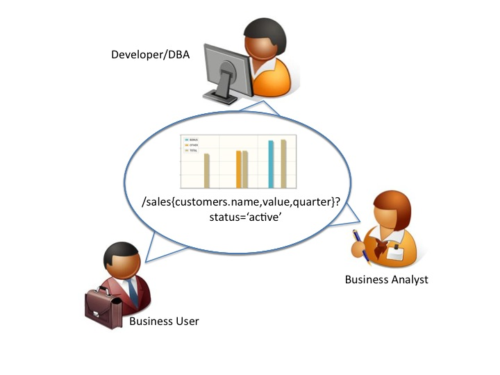

Advanced Query Construction using HTSQL
=======================================

HTSQL is a high-level navigational query language 
and analytical toolkit for relational databases.  
It is written by Kirill Simonov and Clark Evans in 
the Python language.  HTSQL works with SQLite, 
PostgreSQL, MySQL, Oracle, and Microsoft SQL Server.
HTSQL was created to support data analysts.

:Presenter: Clark C. Evans, Prometheus Research, LLC
:Date: Sept 30, 2011
:Location: PGWest US 2011, San Jose, CA

What is HTSQL?
--------------

.. image:: img/what_is_it.png
   :width: 45%
   :align: right

* a web gateway for delational databases
* a navigational query language
* a complement to ORMs for reporting
* a way to describe and socially share data-sets
* a data access tool for accidental progammers

HTSQL is a query language for answering
business inquiries, quickly & correctly,
the first time through.

More Technically
----------------

.. image:: img/service.png
   :width: 99%
   :align: left

Interactive Dashboard in Minutes
--------------------------------

.. image:: img/htraf_screenshot.png
   :width: 45%
   :align: right

Dashboard: Screenshot
---------------------

.. image:: img/htraf_screenshot.png

Dashboard: Source Code
----------------------

Why HTSQL?
----------

.. image:: img/confessional.jpg
   :width: 25%
   :align: right

We wrote HTSQL to enable Data Analysts to 
*self-serve* both simple and complex data
questions without having to spend time in
a confessional booth for SQL mishaps.

Technically, something like an ORM, but 
sharable via the web and focused on complex 
reporting needs rather than CRUD operations.

Socially, a mechanism where business analysts
could give working queries to the development 
staff, rather than the other way around.

In Need of a Shared Language
----------------------------

.. image:: img/triangle.png
   :width: 55%
   :align: right

* data analyst vs programmer
* different reference documents
* different language used
* confusion on data meaning

Collaborative Work Groups
-------------------------

* shared language among team members
* queries are emailed & tweaked
* test cases include live queries
* queries are concrete evidence

The Accidental Programmer
-------------------------

SEQUEL was introduced in 1974 as "a query facility
oriented toward users who are not computer specialists."

"[T]here is also a large class of users who, while
they are not computer specialists, would be willing to
learn to interact with a computer in a reasonably
high-level, non-procedural query language.  Examples
of such users are accountants, engineers, architects,
and urban planners.  It is for this class of users
that SEQUEL is intended."

D.Chamberlin, R.F. Boyce, SEQUEL: A Structured English
Query Language. Proc. ACM SIGFIDET Conference, Ann
Arbor, MI, May 1974 (Page 258)

Relational Algebra is a Poor Fit
--------------------------------

.. image:: img/poorfit.jpg
   :width: 45%
   :align: right

* poor choice for elementary operations 
* difficult encoding of business inquiries
* simple cases pay price of extreme flexibility
* easy to write incorrect 
   queries & not know it

What is Navigational Model?
---------------------------

Let's use entity relationships as navigation,
and build query language around this principle.

* recurrent idea from CODASYL, OODBMS, to ORMs
* intuitive mapping from business inquiries
* automate tedious constructs (joins, casts)
* keep collection based processing
* keep predicate logic & aggregations
* keep projections, but as separate operator

Theory follows practice.

Example University Schema
-------------------------

.. image:: img/schema.png
   :align: left
   :width: 70%

Anatomy of a Query
------------------

SQL conflates Rows & Columns
----------------------------

"Please list departments; for each department,
 show the corresponding school's campus." 

::

     SELECT d.code, d.name, s.campus
     FROM ad.department AS d
     LEFT JOIN ad.school AS s
            ON (d.school_code = s.code);

The business inquiry asks for a specific set of rows, and then
correlated columns.  The SQL encoding returns a subset of a cross
product, making it difficult to ensure what each row represents. 
The ``FROM`` clause doesn't just pick rows, it also plays and an
auxiliary role in choosing columns.

Keep Row Definition Separate
----------------------------

"Please list departments; for each department,
 the show the corresponding school's campus." 

::

    /department{code, name, school.campus}

The navigational translation separates the row definition from the
column selection.  The linking is implicit, and correct.  The encoded
query can be read aloud as a verbal inquiry.

SQL Conflates Filters & Links
-----------------------------

"For each department, return the department's
 name and number of courses having more than
 3 credit hours."

::

     SELECT d.name, COUNT(SELECT TRUE FROM ad.course AS c
                          WHERE c.department_code = d.code
                            AND c.credits > 3  )
     FROM ad.department AS d;

For the SQL encoding of this inquiry we use a subquery to avoid row and
column conflation.  However, ``WHERE`` clause in the subquery conflates
logic filter with the glue linking department and course.

Optimized SQL is Less Clear
---------------------------

"For each department, return the department's
 name and number of courses having more than
 3 credit hours."

::

     SELECT d.name, count(c)
     FROM ad.department AS d
     LEFT JOIN ad.course AS c
            ON (c.department_code = d.code
                AND c.credits > 3)
     GROUP BY d.name;

To optimize, the subquery is replaced by a ``GROUP BY`` projection. 
This gives us both row/column and link/filter conflation, obfuscating
the business inquiry.

Navigational Model Doesn't Conflate
-----------------------------------

"For each department, return the department's
 name and number of courses having more than
 3 credit hours."

::

     /department{name, count(course?credits>3)}

The navigational translation keeps the business logic separate from the
link and the row definition separate from output columns.  The encoded
query corresponds to the original inquiry.

Conflating Projection & Aggregation
-----------------------------------

"How many departments by campus?"

::

   SELECT s.campus, COUNT(d)
   FROM ad.school AS s 
   LEFT JOIN ad.department AS d
     ON (s.code = d.school_code)
   WHERE s.campus IS NOT NULL
   GROUP by s.campus;

In the schema there isn't a ``campus`` table, you have to take
*distinct* values from the school table.  In this SQL query its not
clear if the ``GROUP BY`` is used only to produce an aggregate, you
have to examine primary key columns to know for sure.

Keep Projection Separate
------------------------

"How many departments by campus?"

::

   /(school^campus) {campus, count(school.department)}

In a navigational approach, you first construct the projection
explicitly (using ``^`` operator).  Then, you select from it. 
In this way the aggregation is indicated separately as part of the
column selector rather than being confused with the row definition.

For SQL, Complexity is Painful
------------------------------

"For each school with a degree program, return 
 the school's name, and the average number of 
 high-credit (>3) courses its departments have."
  
::

   SELECT s.name, o.avg_over_3 FROM ad.school AS s
   JOIN ad.program AS p ON (p.school_code = s.code)
   LEFT JOIN (
       SELECT d.school_code, AVG(COALESCE(i.over_3,0)) AS avg_over_3
       FROM ad.department d
       LEFT JOIN (
           SELECT c.department_code, COUNT(c) AS over_3
            FROM ad.course AS c WHERE c.credits > 3
            GROUP BY c.department_code
       ) AS i ON (i.department_code = d.code)
       GROUP BY d.school_code
   ) AS o ON (o.school_code = s.code)
   GROUP BY s.name, o.avg_over_3;

Navigation to the Rescue
------------------------

"For each school with a degree program, return 
 the school's name, and the average number of 
 high-credit (>3) courses its departments have."
  
::

     /(school?exists(program))
       {name, avg(department.count(course?credits>3))} 

Case Study: RexDB Constraints
-----------------------------

.. image:: img/rexdb.jpg
   :width: 35%
   :align: right

.. image:: img/rexdb_navigation.jpg
   :width: 35%
   :align: right

* RexDB is data management platform to help medical researchers
  collect, organize, and analyze data sets.
* Core hierarchy is ``family``, ``individual`` and ``measure``
  plus dozens of support tables.
* One critical task is reporting on a subject's  progress
  though phases of a study and data quality.
* We use constraints to check for inconsistencies that may 
  indicate a data quality problem to be investigated.

Case Study: RexDB Constraints
-----------------------------

* many tabular queries for each report
* entities are rows, checks are columns
* constraints are TRUE/FALSE/NULL (missing data)
* arbitrary subset of entities may be checked
* individual constraints can be very complex

Case Study: RexDB Constraints
-----------------------------

Since rows & columns are clearly isolated, queries can be
composed dynamically.  The general template is::

   /individual{id, check_1, check_2}?filter

For example, to return males participating in the ``'aie'``
study, executing two completely orthogonal checks, we write:: 

  /individual
   .define(srs_13_pair := !exists(srs ? q3>24 | q1>7),
           adi_sanity := ... )
   {id, adi_sanity, srs_13_pair}
   ? sex='m'&exists(participation.study = 'aie')

How do you use it?
------------------

There are several ways you can use HTSQL.

* via ``htsql-ctl`` command line interpreter
* as a Python library /w SQLite in stand-alone programs
* as a WSGI service, integrated /w Django for web apps
* as a web service /w Ruby on Rails, or anything else

Via Command Line
----------------

HTSQL can be used via a command-line interpreter

::

    $ htsql-ctl shell pgsql:htsql_regress
    Interactive HTSQL Shell
    Type 'help' for more information, 'exit' to quit the shell.

    htsql_regress$ /count(student)
     | count(student) |
    -+----------------+-
     |            456 |
                (1 row)

Direct use in Python
--------------------

HTSQL can be used either as a WSGI component,
or directly as a data query tool within Python.

::

    >>> from htsql import HTSQL
    >>> from htsql.request import produce
    >>> htsql = HTSQL('pgsql:htsql_regress')
    >>> with htsql:
    ...     for row in produce('/school'):
    ...         print row
    ...

As a Web Service
----------------

.. image:: img/show_school.png
   :width: 50%
   :align: right

HTSQL can be included as part of your web service
infrastructure: authenticated, cached, proxied,
or how ever you wish to have it integrated.

Development Status
------------------

HTSQL is quite usable currently, but it may
have gaps for a given application.  Particular
items we'll be addressing in coming months are:

* a mechanism to override catalog configuration
* a way to add custom commands & formatters
* a way to list tables, links, and columns
* hierarchical queries & streaming result sets
* support for record-based CRUD operations

How do I get it?
----------------

Open Community

* source code is up on bitbucket
* free of charge for PostgreSQL, MySQL, etc.
* no restrictions on commercial applications
* we are at #htsql on irc.freenode.net

Dual-License & Support

* license for use /w commercial database systems
* we sell support packages and consulting

Q&A
---

Please visit our community site, http://htsql.org, our commercial site
http://htsql.com, we are best found at #htsql on freenode.  The source
code is freely available at http://bitbucket.org/prometheus/htsql

Generous support for HTSQL was provided by The Simons Foundation. 
This material is also based upon work supported by the National 
Science Foundation under Grant #0944460. 

